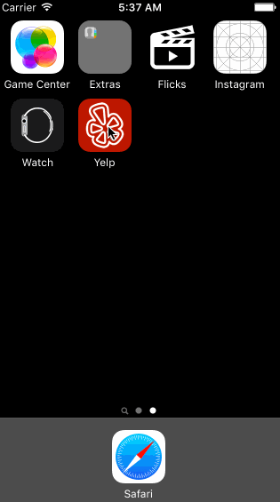

# Project 2 - Yelp

Yelp is a Yelp search app using the [Yelp API](http://www.yelp.com/developers/documentation/v2/search_api).

Time spent: t14+f8+f5+s8-s12 hours spent in total

## User Stories

The following **required** functionality is completed:

- [x] Search results page
   - [x] Table rows should be dynamic height according to the content height.
   - [x] Custom cells should have the proper Auto Layout constraints.
   - [x] Search bar should be in the navigation bar (doesn't have to expand to show location like the real Yelp app does).
- [x] Filter page. Unfortunately, not all the filters are supported in the Yelp API.
   - [x] The filters you should actually have are: category, sort (best match, distance, highest rated), distance, deals (on/off).
   - [x] The filters table should be organized into sections as in the mock.
   - [x] You can use the default UISwitch for on/off states.
   - [x] Clicking on the "Search" button should dismiss the filters page and trigger the search w/ the new filter settings.
   - [x] Display some of the available Yelp categories (choose any 3-4 that you want).

The following **optional** features are implemented:

- [x] Search results page
   - [x] Infinite scroll for restaurant results.
   - [x] Implement map view of restaurant results.
- [x] Filter page
   - [x] Implement a custom switch instead of the default UISwitch.
   - [x] Distance filter should expand as in the real Yelp app *** NOTE *** I did this on sort by instead
   - [x] Categories should show a subset of the full list with a "See All" row to expand. Category list is [here](http://www.yelp.com/developers/documentation/category_list).

- [x] Implement the restaurant detail page.

The following **additional** features are implemented:

- [x] Added distance to search, made it a slider
- [x] Implemented "search" on restaurant name of existing results
- [x] Added custom hud spinner on loading response
- [x] Custom checkbox / radio view
- [x] No result and network error shows error
- [x] Added sort

Please list two areas of the assignment you'd like to **discuss further with your peers** during the next class (examples include better ways to implement something, how to extend your app in certain ways, etc):

1. when segueing search bar background flickers, not sure what is causing this
2. how to override cancel in search bar
3. adding a prototype to custom views seems to break it, how to do this correctly
4. how to auto layout center 2 things that are side by side
5. how to auto layout nested views - really annoyings
6. can you not auto size nromal views based on content?
7. how do you reuse anything or share say like table cells between controllers

## Video Walkthrough

GIF created with [LiceCap](http://www.cockos.com/licecap/).

## Notes

Describe any challenges encountered while building the app.

## License

    Copyright 2016 Julia Yu

    Licensed under the Apache License, Version 2.0 (the "License");
    you may not use this file except in compliance with the License.
    You may obtain a copy of the License at

        http://www.apache.org/licenses/LICENSE-2.0

    Unless required by applicable law or agreed to in writing, software
    distributed under the License is distributed on an "AS IS" BASIS,
    WITHOUT WARRANTIES OR CONDITIONS OF ANY KIND, either express or implied.
    See the License for the specific language governing permissions and
    limitations under the License.